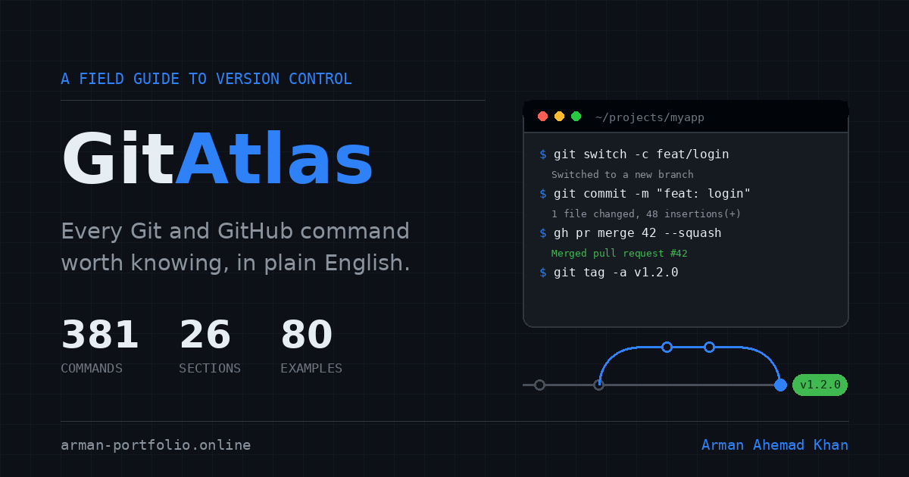

<div align="center">


<a href="https://git-atlas-project.vercel.app">
  
</a>

<br/>

[](https://git-atlas-project.vercel.app)
[](https://github.com/arman080325/GitAtlas-Project/stargazers)
[](https://arman-portfolio.online)
[](LICENSE)
[](#-analytics)


</div>

<br/>

<div align="center">
  
</div>

<br/>

## 💡 Why this repo matters

Every developer has been mid-merge, mid-rebase, or mid-panic and typed **"how do I undo a git commit"** into a search engine for the hundredth time. GitAtlas exists to end that loop — and now it actually **learns from the gaps it finds**.

> It's not another cheat sheet. It's the command you needed, with the *plain-English reason* you needed it, one tap away from your clipboard — and if it doesn't have your command yet, it quietly logs that it should.

**GitAtlas is genuinely useful to the developer community because it:**

- 🧠 **Removes the "which flag was it again?" tax** — every one of the 381 commands ships with a real description and a real use case, not just syntax.
- ⚡ **Saves keystrokes that matter under pressure** — one-tap copy means no retyping a rebase command with shaky hands at 2 AM.
- 🎓 **Teaches while you use it** — a looping hero demo types out a full real-world workflow — branch, commits, push, PR, squash merge, tag — so newcomers see the *shape* of a Git session, not just isolated commands.
- 🛡️ **Warns before you self-destruct** — destructive and history-rewriting commands are flagged automatically, so `git push --force` doesn't ruin someone's afternoon.
- 🔍 **Is fast to search, and gets smarter from it** — every search that comes up empty becomes a content backlog item, written by the people using the tool.
- 🔒 **Respects the audience it's built for** — developers run ad blockers and care about tracking, so analytics are same-origin, cookie-free, and fully optional to even look at.
- 🌐 **Works everywhere, instantly** — no build step, no install, no account. Open `index.html` and you're done.

<br/>

## ✨ Features

<table>
<tr>
<td width="50%" valign="top">

### 📚 Command Coverage
- **381 commands** across **26 sections**
- **80 worked examples** with multi-line, copyable blocks
- Plain-English **description** for every command
- Real-world **use case** for every command
- Concepts and error messages render as clean headings instead of runnable cards

</td>
<td width="50%" valign="top">

### 🧭 Guided Playbooks & Recovery Wizard
- **17 ordered playbooks** — 11 recovery, 6 everyday workflows
- Answer **two questions** and land on the right one
- Every risky step carries a **read-only check to run first**
- Destructive steps say what they **cannot be undone from**
- "Copy all commands" exports the whole playbook as a commented script
- Each playbook is shareable via `#play-<id>`

</td>
</tr>
<tr>
<td width="50%" valign="top">

### 🔎 Search & Navigation
- Instant search across command, description, use case, example, and section name
- Multi-term AND matching with live highlighting
- `/` or `Ctrl`/`Cmd` + `K` to jump straight into search
- `Esc` clears search or closes the mobile section rail
- Sidebar grouped by tag for fast scanning

</td>
</tr>
<tr>
<td width="50%" valign="top">

### 🚨 Smart Risk Badges
- Commands matching destructive patterns are auto-flagged **"Destroys work"**
- History-rewriting commands are auto-flagged **"Rewrites history"**
- Detection logic lives centrally in `riskOf()` — no manual tagging needed
- Risk dot **pulses** so it can't be missed

</td>
<tr>
<td width="50%" valign="top">

### 🛠️ Interactive Command Studio
- **`git log` Visual Builder** — Graph, compact, stat, patch, author, date range, and path filters with live flag breakdown
- **Undo Decision Matrix** — 2-step decision engine mapping intent to `restore` vs `reset` vs `revert` with risk tags and checks
- **Visual `.gitignore` & Attributes Maker** — Checkboxes for OS, IDEs, Node, Python, Rust, Go, secrets + 1-click download
- **Conventional Commit & PR Composer** — Standardized commit message generator (`git commit -m`) and GitHub CLI PR composer (`gh pr create`)

</td>
<td width="50%" valign="top">

### 🎨 Theming
- Follows your **system theme** by default
- Header button cycles **System → Light → Dark → System**
- Manual choice persists in `localStorage` and overrides the OS
- Live re-theme if your OS preference changes mid-session
- Zero flash-of-wrong-theme — resolved pre-paint in `<head>`

</td>
</tr>
<tr>
<td width="50%" valign="top">

### 🎬 Hero Demo & Motion
- Wordmark rises letter by letter, then a slow wave crosses it, then a caret blinks
- Looping **terminal demo**: branch → two commits → push → PR → squash merge → tag, with the commit graph drawing one step behind
- Hero description fades in word by word
- **17 hand-built SVG scenes** act out what each section's commands actually do
- Footer icons pick up their real brand colour on hover and lift, label underlines
- Everything freezes to a finished state under `prefers-reduced-motion`

</td>
<td width="50%" valign="top">

### 📊 Analytics (privacy-first, optional)
- Own Redis counters via **Upstash** — same-origin, so ad blockers don't stop it
- Tracks copies, searches, **empty searches**, section views, example opens, theme changes
- Public read-only stats endpoint feeds the live hero counter
- No cookies, no accounts, no IP storage — honours DNT / GPC, one-line opt-out
- Optional **PostHog** layer and **Vercel Web Analytics** — both inert until configured

</td>
</tr>
<tr>
<td width="50%" valign="top">

### ⚙️ Scroll Performance
- Active section comes from `IntersectionObserver`, not per-frame measuring
- Progress bar animates `transform: scaleX()` only — never triggers layout
- Eased anchor jumps (`easeInOutCubic`, 420–1150ms) cancel the instant you scroll manually
- Hero demo parallax runs on `translate3d` only
- Section animations pause while off screen

</td>
<td width="50%" valign="top">

### ♿ Accessibility
- Skip link straight to the commands
- Visible keyboard focus throughout
- Full `prefers-reduced-motion` support — nothing moves, nothing is lost
- Decorative SVG hidden from screen readers; the wordmark keeps a text label
- Copy feedback announced via `aria-live`

</td>
</tr>
<tr>
<td colspan="2">

### 🖋️ Typography

| Role | Typeface |
|---|---|
| Wordmark & headings | Manrope 700 / 800 |
| Body | IBM Plex Sans |
| Commands / data | IBM Plex Mono |

Fonts load from Google Fonts and degrade gracefully to system fonts if blocked.

</td>
</tr>
</table>

<br/>

## 🗂️ Project structure

```
GitAtlas/
├── index.html     page shell — header, hero, layout, footer
├── styles.css     GitHub Primer palette, both colour modes, motion, responsive rules
├── data.js        the command database (edit this to add commands)
├── flows.js       playbooks + the wizard decision tree
├── app.js         rendering, search, copy, navigation, theme, hero demo
├── analytics.js   anonymous event tracking (client)
├── og.png         1200×630 social preview card
├── api/
│   ├── track.js   POST endpoint — turns events into Redis counters
│   ├── stats.js   GET endpoint  — public aggregate, feeds the hero counter
│   └── _lib/
│       ├── redis.js      Upstash REST client (no dependencies)
│       └── commands.js   generated allowlist — do not edit by hand
├── tools/
│   └── build-allowlist.js   regenerates the allowlist from data.js
├── vercel.json    static hosting config
├── LICENSE
└── README.md
```

Nothing here is generated by a bundler. There is no `package.json`, no `node_modules`, and no build step — the API talks to Upstash over plain `fetch`.

<br/>

## 🚀 Quick start

**No build. No install. No config required.** Just open it.

```bash
git clone https://github.com/arman080325/GitAtlas-Project.git
cd GitAtlas-Project
```

Open `index.html` directly in your browser — that's the whole setup.

Prefer a local server (the clipboard API behaves best on `localhost`):

```bash
python -m http.server 5173
# then open http://localhost:5173
```

To exercise the `/api` endpoints locally as well:

```bash
npx vercel dev        # serves the site and the functions on :3000
```

> A plain static server has no `/api`, so the live counter simply stays hidden. That is expected — the site never depends on analytics being reachable.

<br/>

## ☁️ Deploy to Vercel

<table>
<tr>
<td width="50%" valign="top">

**Option A — Git (recommended)**

```bash
git init
git add .
git commit -m "feat: GitAtlas command reference"
git branch -M main
git remote add origin git@github.com:arman080325/GitAtlas-Project.git
git push -u origin main
```

Then on **vercel.com** → **Add New → Project** → import the repo:

| Setting | Value |
|---|---|
| Framework Preset | Other |
| Build Command | *(empty)* |
| Output Directory | *(root)* |
| Install Command | *(empty)* |

</td>
<td width="50%" valign="top">

**Option B — CLI**

```bash
npm i -g vercel
cd GitAtlas-Project
vercel --prod
```

Every push to `main` redeploys automatically. 🔁

</td>
</tr>
</table>

> **Hosting note:** the site itself is pure static and will run anywhere — GitHub Pages, Netlify, S3. The two analytics endpoints need a platform that runs serverless functions, so on a static-only host they simply 404 and the tracker fails silently by design.

<br/>

## 📊 Analytics

Two layers, because they answer different questions.

**Your own counters** (`/api/track` → Upstash Redis) are the source of truth. The request is same-origin, so ad blockers — which a developer audience runs heavily — do not stop it.

**PostHog** is optional and handles exploration: funnels, retention, session behaviour. Leave `posthogKey` empty in `index.html` and everything else still works.

**Vercel Web Analytics** covers visitors and page views. Enable it in the Vercel dashboard (Project → Analytics); the script tag is already in `index.html` and is inert until you do.

### Setup

1. In Vercel, add the **Upstash** integration from the Marketplace and create a Redis database, then connect it to the project with **all three environments ticked** and the custom prefix left **empty**.

   The integration provisions `KV_REST_API_URL` and `KV_REST_API_TOKEN`; a database created directly on upstash.com gives you `UPSTASH_REDIS_REST_URL` and `UPSTASH_REDIS_REST_TOKEN` instead. `api/_lib/redis.js` reads either pair, so there is nothing to rename.
2. Add `TRACK_SALT` — any random string. It salts the hash used for rate limiting, so raw IPs never exist even in memory beyond the request.
3. Optionally paste a PostHog project key into `window.GITATLAS_ANALYTICS.posthogKey` in `index.html`.
4. Redeploy — environment variables only reach functions at build time.

| Variable | Required | Purpose |
|---|---|---|
| `KV_REST_API_URL` *or* `UPSTASH_REDIS_REST_URL` | yes | Redis REST endpoint |
| `KV_REST_API_TOKEN` *or* `UPSTASH_REDIS_REST_TOKEN` | yes | Write token |
| `TRACK_SALT` | recommended | Salts the rate-limit IP hash |

With none of them set, both endpoints return cleanly, the counter stays hidden, and the site behaves normally.

### What gets recorded

| Event | Why it earns its place |
|---|---|
| `command_copied` | The core metric. Which command, which section, risk level, and whether it came from a search |
| `search_no_results` | **The most useful counter on the site.** Every entry is a command someone expected and the atlas does not have. This is your content backlog, written by your users |
| `search_performed` | The words people actually use. If they search "delete branch" and your entry says "remove", that is a wording bug |
| `section_viewed` | Which of the 26 sections earn their place. Once per section per visit |
| `example_opened` / `example_copied` | Whether the worked examples are worth writing |
| `playbook_opened` | Which recovery paths people actually need, and whether they arrived via the wizard or a direct chip |
| `playbook_copied` | Which playbooks are trusted enough to run |
| `wizard_answer` | How far people get through the wizard. A counter only — no answer text is sent |
| `theme_changed` | How many people override the system default |

Read them back any time:

```bash
curl "https://git-atlas-project.vercel.app/api/stats"            # totals only
curl "https://git-atlas-project.vercel.app/api/stats?detail=1"   # + top commands and missed searches
```

The hero counter appears once the total passes `MIN_COPIES` in `app.js` — set to `1` so it shows immediately. Raise it to 25–100 once there is real traffic; a counter reading "3" undersells the project.

### Privacy and abuse

- No cookies, no accounts, no IP storage. The only identifier is a random string in `sessionStorage` that dies with the tab.
- `Do Not Track` and Global Privacy Control are honoured — those visitors send nothing at all.
- Anyone can opt out permanently from the footer link, or from the console with `GitAtlasAnalytics.optOut()`.
- `/api/track` **rejects any command string not in the generated allowlist**, so a public write endpoint cannot be used to pollute the leaderboard with junk keys. Search terms are stripped to `[a-z0-9 ._:/-]` and capped at 40 characters before they can become a Redis key.
- Rate limited to 120 requests per minute per **hashed** IP, 25 events per request, 300 events per browser tab.
- Every failure is silent. A blocked or offline request never affects the page.

> ⚠️ After adding or editing commands in `data.js`, run `node tools/build-allowlist.js` so the API will count the new ones.

<br/>

## 🧩 Adding or editing commands

Everything lives in `data.js`. A section looks like this:

```js
{
  id: "stash",                    // becomes the URL anchor (#stash)
  label: "Stashing",              // heading and rail label
  tag: "rescue",                  // groups it in the sidebar
  blurb: "One line under the heading.",
  commands: [
    {
      c: 'git stash',                        // the command (copied on click)
      d: 'What it does, in plain English.',  // description
      e: 'When you would reach for it.',     // use case
      x: 'optional\nmulti-line\nexample'     // optional, shows under "Example"
    }
  ]
}
```

The app handles the rest automatically:

- **Copy buttons** appear only on runnable commands — concept and error entries become plain headings.
- **Risk badges** are computed, not tagged, via `riskOf()` in `app.js`.
- **Search** indexes every field for free.
- **Section animations** are mapped in `SCENE_FOR`; a new section falls back to a sensible default.
- Group names for `tag` live in `GROUPS` at the top of `app.js`.

<br/>

## 🧭 Adding a playbook

Playbooks live in `flows.js` and drive both the wizard and the direct-access chips.

```js
{
  id: "lost-commit",              // also the deep link: #play-lost-commit
  kind: "rescue",                 // "rescue" or "workflow" — sets the badge colour
  title: "Recover a lost commit or deleted branch",
  goal: "One line on what this achieves.",
  when: "When someone should reach for it.",
  steps: [
    {
      do: "What this step achieves, in plain English.",
      cmd: "git reflog",                                  // may be multi-line
      check: { cmd: "git status", why: "Why to run this first." },   // optional
      warn: "What this cannot be undone from."                       // optional
    }
  ],
  after: "What to do once the playbook is finished.",
  related: ["undo", "branch"]     // section ids from data.js
}
```

To make it reachable from the wizard, add a leaf to the `WIZARD` tree in the same file:

```js
{ label: "I ran reset --hard", play: "hard-reset-oops" }
```

A leaf can also carry `jump: "fix-assistant"` to hand off to another section instead of opening a playbook.

> Run `node tools/build-allowlist.js` after adding a playbook, or the API will drop its analytics events.

## ⌨️ Keyboard shortcuts

| Key | Action |
|---|---|
| `/` or `Ctrl` / `Cmd` + `K` | Focus the search box |
| `Esc` | Clear the search, or close the mobile section list |

<br/>

## 🎨 Colour system

Colours follow GitHub's Primer palette:

| Mode | Background | Surface | Accent | Destructive |
|---|---|---|---|---|
| Dark | `#0d1117` | `#161b22` | `#2f81f7` | `#f85149` |
| Light | `#ffffff` | `#f6f8fa` | `#0969da` | `#cf222e` |

<br/>

## 🔗 Add it to your portfolio

```html
<a class="project-card" href="https://git-atlas-project.vercel.app" target="_blank" rel="noopener">
  <h3>GitAtlas</h3>
  <p>A searchable field guide to 381 Git &amp; GitHub commands — plain-English
     descriptions, real use cases and one-tap copy, in a GitHub-native interface.</p>
  <span>Developer tooling · Reference</span>
</a>
```

Want it on a subdomain? In **Vercel → Project → Settings → Domains**, add `git.arman-portfolio.online`, then point a matching CNAME at it from your DNS.

> After moving to a custom domain, update the four absolute URLs in `index.html`'s `<head>` — `canonical`, `og:url`, `og:image` and `twitter:image` — or link previews will keep resolving to the old address.

<br/>

## 🛠️ Built with

<div align="center">


-000000?style=for-the-badge&logo=posthog&logoColor=white)


</div>

No framework, no bundler, no runtime dependencies.

<br/>

## 🤝 Contributing

Found a command that's missing, wrong, or explained badly? Pull requests are very welcome.

1. Fork the repo
2. Add or edit an entry in `data.js` — keep the description plain and the use case concrete
3. Run `node tools/build-allowlist.js` (required whenever `data.js` changes)
4. Open `index.html` and check your entry renders, searches and copies
5. Open a PR with a short note on what changed and why

<br/>

## 📌 Notes

- Browser storage is used for exactly three things: your theme choice and an analytics opt-out flag in `localStorage`, and a throwaway session id in `sessionStorage`. Nothing else is stored.
- Fonts load from Google Fonts and degrade to system fonts if blocked.
- `api/_lib/commands.js` is generated — edit `data.js` and regenerate instead.

<br/>

## 📄 License

Released under the **MIT License** — see [LICENSE](LICENSE). Use it, fork it, ship your own version.

<br/>

<div align="center">

### If GitAtlas saved you a Google search, consider starring it ⭐

<a href="https://github.com/arman080325/GitAtlas-Project/stargazers">
  
</a>

Maintained by **[Arman Ahemad Khan](https://arman-portfolio.online)**


</div>